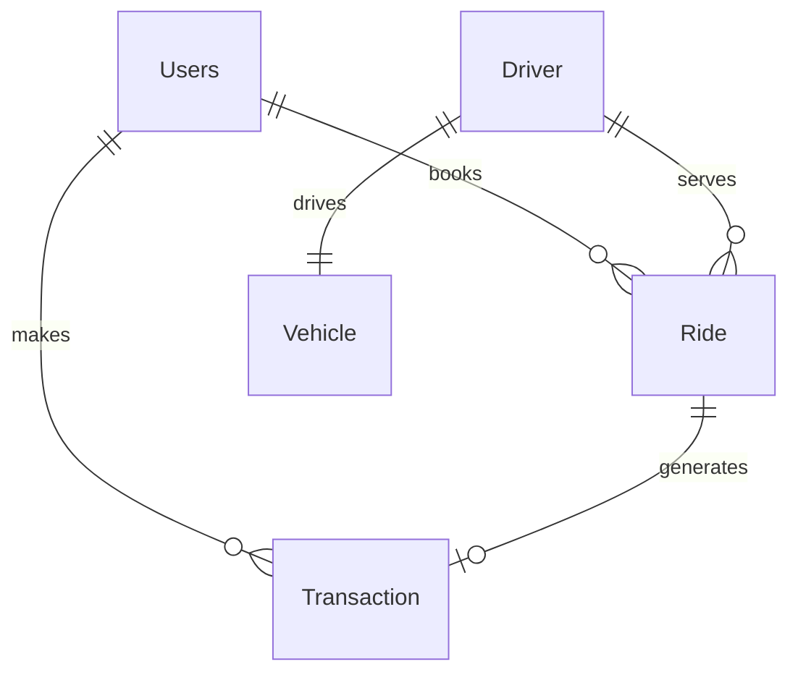

# 🏍️ RidingBikeSystem

[](https://www.oracle.com/java/)
[](https://maven.apache.org/)
[](https://hibernate.org/)
[](https://www.postgresql.org/)

A robust, console-based **Ride Booking Application** implemented in Java using Hibernate ORM (JPA) and PostgreSQL database. The system allows managing users, drivers, vehicles, booking/completing rides, processing wallet-based transactions, and viewing structured performance reports.

---

## 🚀 Features

The system offers a comprehensive CLI menu divided into administrative and customer operations:

1. **👤 Manage Users**
   - Add new users with email validation (`@Email`)
   - View all registered users
   - Update user details (name, email, phone number)
   - Delete users
   - Query user by ID

2. **🚗 Manage Drivers**
   - Register drivers
   - Track driver status (`AVAILABLE`, `BUSY`, `OFFLINE`)
   - Update/Delete drivers
   - Query driver by ID

3. **🚲 Manage Vehicles**
   - Register vehicles with type categorization (`BIKE`, `AUTO`, `CAB`)
   - Link vehicles to drivers
   - Update/Delete vehicles

4. **🗺️ Manage Rides**
   - Book a ride by matching users and available drivers
   - Complete rides (automatically updates driver status and processes payments)
   - Cancel rides
   - Track ride history

5. **💳 Transactions**
   - Automatic transaction generation on ride completion
   - View transaction details and logs

6. **📊 Reports Panel**
   - Ride history of a specific user
   - Completed rides of a specific driver
   - Transaction statements for users
   - Filter drivers by status (`AVAILABLE`, `BUSY`, `OFFLINE`)

7. **🛡️ Advanced Features**
   - Add money to user wallet
   - Reassign a vehicle to a driver dynamically

---

## 🛠️ Tech Stack & Architecture

- **Language**: Java 17+
- **Database**: PostgreSQL (JDBC Driver `42.7.7`)
- **ORM Framework**: Hibernate Core `6.4.4.Final` (JPA 3.1)
- **Validation**: Hibernate Validator `8.0.2.Final`
- **Build Tool**: Maven

### Database Schema Entity Relationships



- **Users**: Consists of `id`, `name`, `email` (validated), `phoneNumber`, and `wallet` balance.
- **Driver**: Consists of `id`, `name`, `phoneNumber`, `status` (`DriverStatus` enum), and a one-to-one relationship with `Vehicle`.
- **Vehicle**: Consists of `id`, `vehicleNumber`, `model`, `type` (`VehicleType` enum), and owner `Driver`.
- **Ride**: Consists of `id`, `source`, `destination`, `fare`, `status` (`RideStatus` enum), associated `Users`, and `Driver`.
- **Transaction**: Consists of `id`, `transactionMode` (`TransactionMode` enum), `amount`, `timestamp`, and associated `Users`.

---

## ⚙️ Setup & Configuration

### Prerequisites
1. **Java Development Kit (JDK)** 17 or higher.
2. **Apache Maven** installed and added to your system path.
3. **PostgreSQL** database server running locally.

### 1. Database Setup
Create a PostgreSQL database named `rideBookingSystem`:
```sql
CREATE DATABASE "rideBookingSystem";
```

### 2. Configure Hibernate (JPA)
Edit the [persistence.xml](src/main/resources/META-INF/persistence.xml) file to update your database credentials if different:
```xml
<property name="jakarta.persistence.jdbc.url" value="jdbc:postgresql://localhost:5432/rideBookingSystem"/>
<property name="jakarta.persistence.jdbc.user" value="postgres"/>
<property name="jakarta.persistence.jdbc.password" value="YOUR_PASSWORD"/>
```
*Note: The `hibernate.hbm2ddl.auto` setting is set to `update`, which will automatically create the tables on the first run.*

---

## 🏃 Running the Application

### Build the Project
Compile the project and resolve all Maven dependencies:
```bash
mvn clean compile
```

### Execute the CLI Application
Run the main driver class:
```bash
mvn exec:java -Dexec.mainClass="com.ride.main.RideDriver"
```

---

## 📂 Project Structure

```
RidingBikeSystem/
├── src/
│   ├── main/
│   │   ├── java/
│   │   │   └── com/ride/
│   │   │       ├── dao/          # Database Access Objects (CRUD helpers)
│   │   │       ├── entity/       # JPA Entities (User, Driver, Ride, etc.)
│   │   │       ├── enums/        # Status and categorization enums
│   │   │       ├── service/      # Main business logic layer
│   │   │       └── main/         # Entry points (RideDriver & Hibernate Config)
│   │   └── resources/
│   │       └── META-INF/
│   │           └── persistence.xml  # JPA persistence configuration
│   └── test/                     # Unit & Integration tests
├── pom.xml                       # Maven dependency management
└── .gitignore                    # Git file exclusions
```
